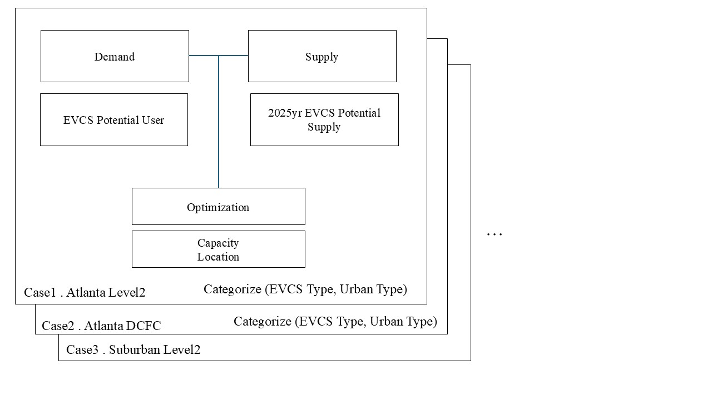

# ACM-SIGSPATIAL-Cup-2024

### SCSI Lab, Yonsei University

This repository contains the code and research framework developed for the ACM SIGSPATIAL 2024 GIS Cup. The project focuses on optimizing the locations and capacities of Electric Vehicle Charging Stations (EVCS) in the state of Georgia, USA. The overall objective is to balance the accessibility of EVCS while ensuring that the distribution of charging stations meets future demand.

---

## 0. Conda Environment Setup

Before running the project, it is recommended to set up a Conda environment. Follow these steps to create and activate the Conda environment:

### Step 1: Create a Conda Environment

Run the following command to create a Conda environment (named `acm2024_env`):

```bash
conda create --name acm2024_env python=3.10
```

### Step 2: Activate the Conda Environment

Activate the Conda environment using the following command:

```bash
conda activate acm2024_env
```

### Step 3: Install Required Packages

Once the Conda environment is activated, install the required packages listed in the `requirements.txt` file:

```bash
pip install -r requirements.txt
```

## 1. Description

Our research framework for determining the optimal locations of EVCS consists of several key steps:



### Demand:
We analyzed potential users who would utilize EVCS based on Origin-Destination (OD) data, OpenStreetMap road network data, and provided Point of Interest (POI) data. This data was preprocessed to create a **demand map** representing areas of high potential EVCS usage.

### Capacity:
Considering the expected penetration of EVCS in Georgia by 2025, we calculated the potential **capacity map**. This was derived using car registration data, the H-T Index, and OD data to estimate the necessary EVCS capacity to meet future demand.

### EVCS Location and Capacity Optimization:
Our core optimization algorithm combines **Greedy algorithms** and **Quadratic Programming (QP)**. Using the **Two-Step Floating Catchment Area (2SFCA)** method as a framework, we calculated the accessibility at demand points and trained our model to minimize the standard deviation of the accessibility index. This ensures that the placement of EVCS locations is fair and efficient.

### Post-Processing:
To ensure resilience, we processed disaster-related data (e.g., power outage data, Justice40 Climate Data). EVCS locations identified in high-risk areas were excluded from the final results.

### Spatial Categories:
Georgia was divided into four spatial categories to reflect urban and non-urban influences:
- **Category 1**: Atlanta
- **Category 2**: Suburban (Urban areas excluding Atlanta)
- **Category 3**: Rural
- **Category 4**: Highway

### Charger Types:
EVCS charger types were classified as follows:
- **Category 1**: DC Fast Chargers (DCFC)
- **Category 2**: Level 2 Chargers (Fast Chargers)

Based on these classifications, we optimized the EVCS network for a total of **seven scenarios**:

1. **Case 1**: Atlanta Level 2
2. **Case 2**: Atlanta DCFC
3. **Case 3**: Suburban Level 2
4. **Case 4**: Suburban DCFC
5. **Case 5**: Rural Level 2
6. **Case 6**: Rural DCFC
7. **Case 7**: Highway DCFC

The optimization process was consistent across all cases, producing reasonable and effective results.

---

## 2. Run This Code

Each scenario can be executed and evaluated using corresponding Jupyter Notebooks provided in the repository. The notebooks follow the naming convention `{region}_{charger_type}.ipynb`, and each one is tailored to the specific spatial category and charger type. This allows for flexible testing and validation of different cases.

For example:
- **Case 1**: Execute `atlanta_lv2.ipynb` to optimize the EVCS in Atlanta with Level 2 chargers.
- **Case 3**: Execute `suburban_dcfc.ipynb` to optimize the EVCS in suburban areas with DC Fast Chargers.

These notebooks contain the full pipeline, from data preprocessing and POI selection to the final EVCS optimization.

---

## 3. Detailed Steps

### Step 1: POI Candidate Selection
The first step involves filtering POIs for Atlanta, Suburban, and Rural areas. Using Geographic Information System (GIS) tools, we analyzed provided POIs and extracted new candidates from OpenStreetMap (OSM). After this filtering, we identified potential sites for EVCS installation based on categories like supermarkets, city halls, and hotels.

### Step 2: Initial POI Selection
From the filtered POIs, we selected initial points for installation:
- **For Level 2 Chargers**: POIs were further refined to select high-probability installation sites.
- **For DCFC**: Initial POIs were selected using road network data, focusing on motorways and intersections.

### Step 2.a: EVCS Location Selection
In areas where the demand is low and only one or two EVCS are needed, the initial POI often becomes the final EVCS location. In these cases, the location is selected by cross-referencing the POIs with the demand map to find the optimal site. This approach is consistent for both Level 2 and DCFC chargers.

### Step 3: EVCS Optimization
This step focuses on optimizing the EVCS location and capacity using a combination of Greedy algorithms and Quadratic Programming (QP):
1. **Location Optimization**: The Greedy algorithm selects the optimal EVCS locations by minimizing the standard deviation of accessibility across demand points.
2. **Capacity Optimization**: Quadratic Programming (QP) is used to allocate the optimal number of charging ports to each EVCS location. The goal is to balance supply and demand while minimizing the standard deviation of the accessibility index at the demand points. This ensures that the distribution of charging capacity is fair and efficient.

### Constraints:
- **Minimum Ports**: All EVCS locations are assigned at least 1 port to ensure functionality.
- **Urban Limits**: In urban areas, the number of ports is constrained between 2 and 25 to prevent excessive allocation in high-demand locations, based on real-world EVCS data.

### Capture Range and Bandwidth:
- **Urban Areas**: Capture range of 3000 meters and bandwidth of 1000 meters, reflecting shorter travel distances.
- **Suburban/Rural Areas**: Capture range of 4000 meters and bandwidth of 1500 meters, as residents in these areas are more willing to travel further distances for services, such as healthcare or charging stations.

---

## 4. Code Execution

After processing, the output files (such as the optimized EVCS locations) will be saved in the specified output directory.

To run the optimization for any scenario, simply open the corresponding Jupyter Notebook (`{region}_{charger_type}.ipynb`), update the paths as needed, and execute the cells.

For instance:
- **Case 1**: Open and run `atlanta_lv2.ipynb` for Atlanta with Level 2 chargers.
- **Case 3**: Open and run `suburban_dcfc.ipynb` for suburban DC Fast Chargers.

Each notebook is configured for its respective scenario, so you can test different regions and charger types independently.

**Note**: Processing larger datasets (e.g., Atlanta) may take significantly longer. For quicker validation, you may start with smaller regions such as suburban or rural areas.

---

Best regards,  
**Team SCSI**