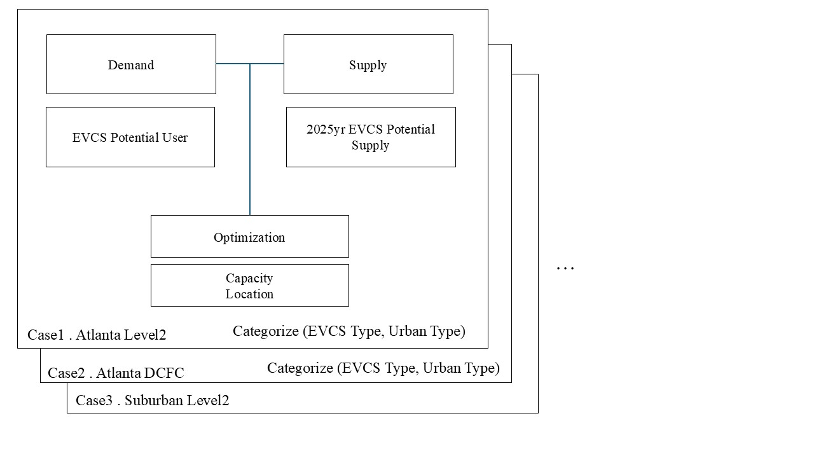

**README**

---

**1. Description**

Our research framework for determining the optimal locations of Electric Vehicle Charging Stations (EVCS) is as follows:

**Demand**: We considered potential users who would utilize EVCS. The data used include Origin-Destination (OD) data, OpenStreetMap road network data, and provided Point of Interest (POI) data. These datasets were preprocessed to create a demand map.

**Capacity**: Considering the future penetration rate of EVCS in Georgia, we calculated the potential capacity of EVCS for the near future, specifically the year 2025. The data used include car registration data from the H-T Index and OD data, which were utilized to create a capacity map.

**EVCS Location Capacity Optimization**: This is the main optimization algorithm used in our research. We calculated accessibility by considering the bidirectional impact based on the created demand and capacity maps. The method employed is the Two-Step Floating Catchment Area (2SFCA) approach as a basic framework. Furthermore, we incorporated fairness by training the model to minimize the standard deviation of the accessibility index.

**Post Processing**: We processed disaster-related information from power outage data and Justice40 Climate Data. EVCS locations in high-risk areas were removed from the final results.

**Categorization**: This is the most crucial part of our project. Georgia consists of various urban and non-urban areas. Even within urban regions, suburbs are distributed throughout the state with Atlanta as the central city, and rural areas exist in between. To reflect these influences, we divided Georgia into three main categories and conducted our research accordingly.

**Spatial Categories**:

- **Category 1**: Atlanta
- **Category 2**: Suburban (Urban areas excluding Atlanta)
- **Category 3**: Rural
- **Category 4**: Highway

Additionally, the charger type of EVCS is a significant factor in charging optimization. In particular, DC Fast Chargers (DCFC) tend to be installed mainly along major highways. Since it is common in previous studies to perform optimization after classifying charger types, we also conducted optimization after categorizing the charger types.

**Charger Types**:

- **Category 1**: DCFC (Ultra-fast Chargers)
- **Category 2**: Level 2 (Fast Chargers)

Through these classifications, we conducted optimization for a total of seven cases:

1. **Case 1**: Atlanta Level 2
2. **Case 2**: Atlanta DCFC
3. **Case 3**: Suburban Level 2
4. **Case 4**: Suburban DCFC
5. **Case 5**: Rural Level 2
6. **Case 6**: Rural DCFC
7. **Case 7**: Highway DCFC

The results are very reasonable.

---

For Cases 1 to 6, we worked with the same demand map and capacity.

The process of estimating the demand and capacity maps is saved as a Jupyter Notebook in the following folder: "Directory within GitHub"

---

**Step 1: POI Candidate Selection (Candidates for EVCS)**

First, the capacities for Atlanta, Suburban, and Rural areas were estimated, and the demand map was also created. To determine the appropriate locations for EVCS, we conducted POI filtering. We visually verified the provided POI and the POI extracted from OSM using Geographic Information System (GIS) and confirmed that the reliability level of the provided POI was low. Therefore, we performed POI filtering based on OSM_POI. Through this filtering, we identified appropriate candidates for EVCS installation (e.g., supermarkets, city halls, hotels) and classified them by category (spatial unit, charger type).

---

**Step 2: Initial POI Selection**

Next, we selected the initial points that must be installed from the filtered POI candidates. The optimization process was conducted based on these initial points.

- **For Level 2 Type**: We selected initial POIs that are high-probability candidates for installation through more refined additional filtering among the POI candidates.
- **For DCFC**: We utilized road network data to extract highways and selected initial POIs using an algorithm that leverages geospatial information (e.g., intersections) of motorways and trunkways among the highways.

---

**Step 2.a: Select EVCS Location**

In certain cases, the following situation occurs: If the capacity allocated to a county is generally low and only one or two EVCS need to be installed, the initial POI becomes the EVCS installation location. In this case, we used an algorithm that cross-examines the filtered POIs and the demand map to install the EVCS at the location with the highest score. We applied the same algorithm for both Level 2 and DCFC.

---

**Step 3: EVCS Optimization**

*"Detailed explanation by Sehun"*

---

Based on the classification of the above steps, the cases operate with different steps to derive the optimal conclusion for each.

---

**Case 1: Atlanta Level 2**

- **Step 1 - POI Candidate Selection**: Since there is a sufficient number of POIs with high reliability, we selected POI candidates through POI filtering suitable for the area.
- **Step 2 - Select Initial Point**: Similarly, due to the sufficient number of reliable POIs, we selected initial POIs through secondary filtering.
- **Step 3 - EVCS Optimization**

---

**Case 2: Atlanta DCFC**

- **Step 1 - POI Candidate Selection**: Since there is a sufficient number of POIs with high reliability, we selected POI candidates through POI filtering suitable for the area.
- **Step 2 - Select Initial Point**: Although there are enough POIs, considering the high influence of highways on DCFC, we selected initial POIs by considering the impact of highway roads.
- **Step 3 - EVCS Optimization**

---

**Case 3: Suburban Level 2**

- **Step 1 - POI Candidate Selection**: Since there is a sufficient number of POIs with high reliability, we selected POI candidates through POI filtering suitable for the area.
- **Step 2 & Step 2.a - Select Initial Point & Select EVCS Location**:
  - **a)** If the allocated capacity is sufficient, we used the same method as in Cases 1 and 2.
  - **b)** When considering the allocated capacity, there are locations where only one or two EVCS need to be installed; in these cases, we decided by considering both POIs and demand simultaneously.
- **Step 3 - EVCS Optimization**

---

**Case 4: Suburban DCFC**

- **Step 1 - POI Candidate Selection**: Since there is a sufficient number of POIs with high reliability, we selected POI candidates through POI filtering.
- **Step 2.a - Select EVCS Location**: For locations where one or two EVCS need to be installed, we selected EVCS locations by considering the road network and demand map.

---

**Case 5: Rural Level 2**

- **Step 1 - POI Candidate Selection**: Since there is a sufficient number of POIs with high reliability, we selected POI candidates through POI filtering.
- **Step 2.a - Select EVCS Location**: In locations where one or two EVCS need to be installed and the influence of the road network is minimal, we selected EVCS locations by considering only the demand map.

---

**Case 6: Rural DCFC**

- **Step 1 - POI Candidate Selection**: Since there is a sufficient number of POIs with high reliability, we selected POI candidates through POI filtering.
- **Step 2.a - Select EVCS Location**: In locations where one or two EVCS need to be installed and the influence of the road network is minimal, we selected EVCS locations by considering only the demand map.

---

**Case 7: Highway DCFC**

*"Additional explanation by Jaeyoung"*

---