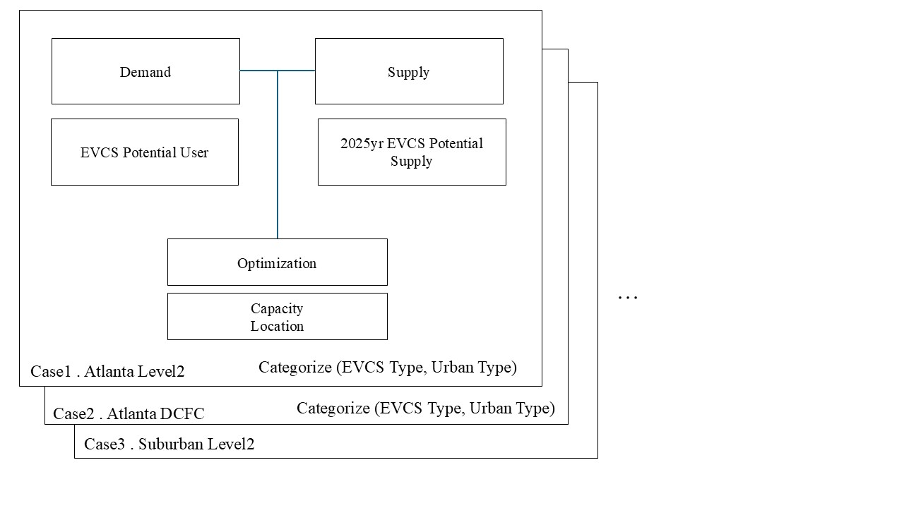

# ACM SIGSPATIAL Cup 2024 EVCS Optimization

This repository contains code and research notes developed by SCSI Lab,
Yonsei University, for the ACM SIGSPATIAL 2024 GIS Cup. The project optimizes
locations and capacities for electric vehicle charging stations (EVCS) in
Georgia, USA, balancing accessibility and future charging demand.

## Overview

The workflow combines geospatial preprocessing, candidate POI selection,
greedy site selection, and quadratic programming capacity allocation. The
optimization uses a 2SFCA-inspired accessibility objective to reduce variation
in accessibility across demand points.



## Repository Contents

- `src/`: reusable Python modules for demand extraction, greedy selection, and
  capacity optimization
- `notebooks/`: cleaned research notebooks kept as supplementary workflow notes
- `results/final/`: curated final EVCS GeoPackage outputs
- `poi_filtering.yaml`: POI class filters used for candidate and initial site
  selection
- `figure/`: lightweight figures used in the README
- `DATA_POLICY.md`: data storage and sharing policy
- `requirements.txt`: installable Python dependency list

Large data, intermediate geospatial layers, optimization traces, and logs are
not stored in git. See [DATA_POLICY.md](DATA_POLICY.md).

## Method Summary

1. Build EVCS demand and supply layers from OD, road, POI, and registration
   data.
2. Split Georgia areas into spatial categories such as Atlanta, suburban, rural,
   and highway scenarios.
3. Filter candidate POIs by charger type and region type.
4. Select initial sites directly for low-demand regions.
5. Run greedy optimization for multi-site regions.
6. Allocate charging capacity with quadratic programming.
7. Post-process locations with outage or hazard-risk constraints.

## Local Setup

Create and activate a clean Python environment:

```bash
conda create --name acm2024-evcs python=3.10
conda activate acm2024-evcs
pip install -r requirements.txt
```

Some geospatial packages, especially `geopandas`, `rasterio`, and `pyogrio`,
may be easier to install with conda-forge on some systems:

```bash
conda install -c conda-forge geopandas rasterio pyogrio osmnx cvxpy
```

## Data Layout

Place raw and processed data locally using this structure:

```text
data/
  raw/
  processed/
  road/
  poi/
  region_polygon/
  for_model/
outputs/
  results/
  logs/
```

These paths are ignored by git.

## Curated Results

Selected final GeoPackage outputs are provided under `results/final/`:

- `dcfc_evcs.gpkg`: final DC fast charging station layer
- `level2_evcs.gpkg`: final Level 2 charging station layer
- `highway_dcfc.gpkg`: final highway DC fast charging station layer
- `suburban_dcfc.gpkg`: suburban DC fast charging selected sites
- `suburban_dcfc_mclp_selected.gpkg`: suburban DC fast charging MCLP-selected sites
- `suburban_lv2.gpkg`: suburban Level 2 selected sites
- `suburban_lv2_mclp_selected.gpkg`: suburban Level 2 MCLP-selected sites

Intermediate optimization traces such as per-step `Ai_*.ssv` and `supply_*.ssv`
files are intentionally not tracked.

## Notebooks

The notebooks under `notebooks/` are retained as supplementary research notes.
They have been stripped of execution outputs and should be treated as examples
that may require local data paths and competition-provided inputs.

Scenario notebooks:

- `notebooks/scenarios/urban_lv2.ipynb`
- `notebooks/scenarios/urban_dcfc.ipynb`
- `notebooks/scenarios/suburban_lv2.ipynb`
- `notebooks/scenarios/suburban_dcfc.ipynb`
- `notebooks/scenarios/rural.ipynb`
- `notebooks/scenarios/highway_dcfc.ipynb`

Preprocessing and post-processing notebooks are under:

- `notebooks/data_preprocessing/`
- `notebooks/post_processing/`

## Core Modules

- `src/process_polygon.py`: extracts demand values and candidate-site distance
  matrices for one region polygon
- `src/capacity_optimizer.py`: solves the capacity allocation QP and reports
  accessibility metrics
- `src/greedy_optimization.py`: iteratively selects EVCS locations and writes
  scenario outputs
- `src/utils.py`: helper functions for logging, geospatial merging, POI counts,
  and visualization

## Output Policy

Generated files should be written to `outputs/` or `results/` locally. Do not
commit generated `.gpkg`, `.tif`, `.csv`, `.xlsx`, `.ssv`, or log files unless
they are deliberately curated as small examples with provenance.

## License

This project is licensed under the terms in [LICENSE](LICENSE).
